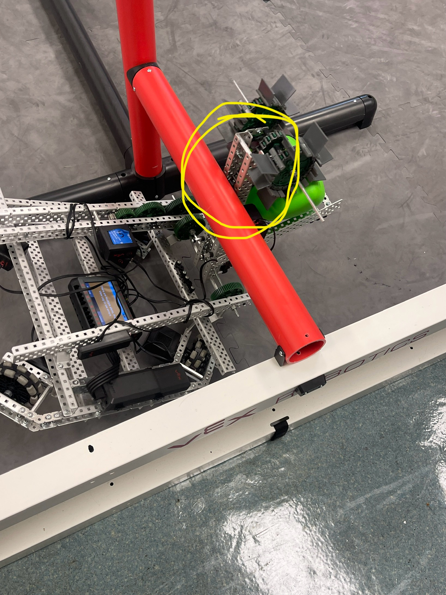
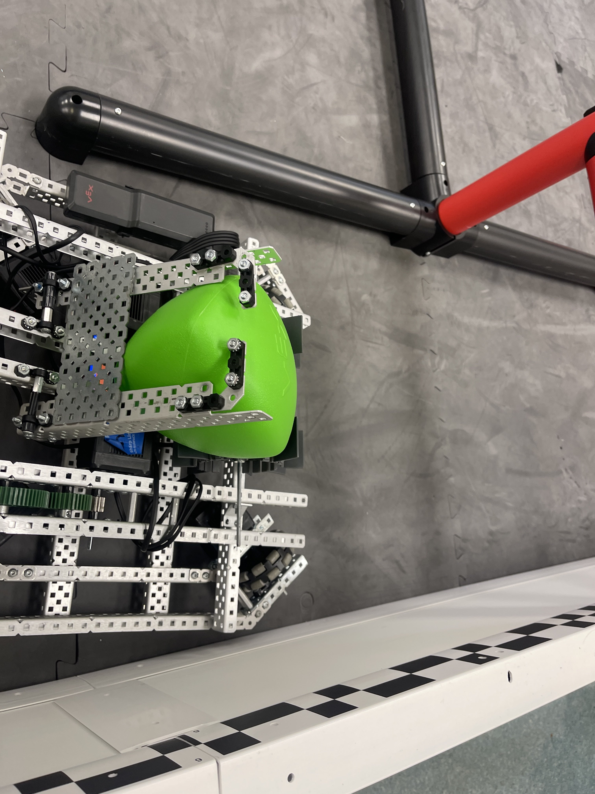

Since our _holonomic_ code from lat year only had four motors programmed, we had to create a brand new code using some of the VEX Sample code. We are now able to fully operate our robot to its maximum capacity. One basic change that we made was adjust the velocity of the _scooper_ to 25% from the default 30%. Our thinking was that we needed to stress contact towards our triballs using the rubber flaps to make it work better.

#### Code:
```{"mode":"Text","textContent":"\n#region VEXcode Generated Robot Configuration\nfrom vex import *\nimport urandom\n\n# Brain should be defined by default\nbrain=Brain()\n\n# Robot configuration code\nmotor_1 = Motor(Ports.PORT1, GearSetting.RATIO_18_1, True)\nmotor_2 = Motor(Ports.PORT2, GearSetting.RATIO_18_1, True)\nmotor_3 = Motor(Ports.PORT3, GearSetting.RATIO_18_1, False)\nmotor_4 = Motor(Ports.PORT4, GearSetting.RATIO_18_1, False)\narm_motor5 = Motor(Ports.PORT5, GearSetting.RATIO_18_1,True)\nmotor_scoop6 = Motor(Ports.PORT6, GearSetting.RATIO_18_1,True)\ncontroller_1 = Controller(PRIMARY)\narm_motor5.set_velocity(60,PERCENT)\nmotor_scoop6.set_velocity(25,PERCENT)\n\n# wait for rotation sensor to fully initialize\nwait(30, MSEC)\n#endregion VEXcode Generated Robot Configuration\nmyVariable = 0\n\ndef when_started1():\n    global myVariable\n    motor_1.spin(FORWARD)\n    motor_2.spin(FORWARD)\n    motor_3.spin(FORWARD)\n    motor_4.spin(FORWARD)\n    while True:\n        motor_1.set_velocity((controller_1.axis3.position() - (controller_1.axis4.position() + controller_1.axis1.position())), PERCENT)\n        motor_2.set_velocity((controller_1.axis3.position() + (controller_1.axis4.position() - controller_1.axis1.position())), PERCENT)\n        motor_3.set_velocity((controller_1.axis3.position() - (controller_1.axis4.position() - controller_1.axis1.position())), PERCENT)\n        motor_4.set_velocity((controller_1.axis3.position() + (controller_1.axis4.position() + controller_1.axis1.position())), PERCENT)\n        if controller_1.buttonL1.pressing():\n            arm_motor5.spin(FORWARD)\n        elif controller_1.buttonL2.pressing():\n            arm_motor5.spin(REVERSE)\n        else:\n            arm_motor5.stop()\n\n        if controller_1.buttonR1.pressing():\n            motor_scoop6.spin(FORWARD)\n        elif controller_1.buttonR2.pressing():\n            motor_scoop6.spin(REVERSE)\n        else:\n            motor_scoop6.stop()\n        wait(5, MSEC)\n\n\n\nwhen_started1()\n","textLanguage":"python","rconfig":[{"port":[3],"name":"claw_motor","customName":true,"deviceType":"Motor","deviceClass":"motor","setting":{"reversed":"false","fwd":"forward","rev":"reverse","gear":"ratio18_1"},"triportSourcePort":22},{"port":[8],"name":"arm_motor","customName":true,"deviceType":"Motor","deviceClass":"motor","setting":{"reversed":"false","fwd":"forward","rev":"reverse","gear":"ratio18_1"},"triportSourcePort":22},{"port":[],"name":"controller_1","customName":false,"deviceType":"Controller","deviceClass":"controller","setting":{"left":"","leftDir":"false","right":"","rightDir":"false","upDown":"","upDownDir":"false","xB":"","xBDir":"false","drive":"none","id":"primary"},"triportSourcePort":22},{"port":[1],"name":"left_motor","customName":true,"deviceType":"Motor","deviceClass":"motor","setting":{"reversed":"false","fwd":"forward","rev":"reverse","gear":"ratio18_1","id":"partner"},"triportSourcePort":22},{"port":[10],"name":"right_motor","customName":true,"deviceType":"Motor","deviceClass":"motor","setting":{"reversed":"true","fwd":"forward","rev":"reverse","gear":"ratio18_1"},"triportSourcePort":22}],"slot":0,"platform":"V5","sdkVersion":"20220726.10.00.00","appVersion":"3.0.3","minVersion":"3.0.0","fileFormat":"1.2.0","icon":"","targetBrainGen":"First","v5Sounds":[{"name":"game over","url":"static/sounds/mixkit-arcade-retro-game-over-213.wav"}],"v5SoundsEnabled":false,"target":"Physical"}```


**Insert a video once figured out or a gif.**
#### Upgrades to be done upcoming:
* Add hooks to the circled area and try and elevate the robot using the scooper's arm motor.


   
* figure out if we can add another motor to try and ease the strain on the single motor 
* Replace the front C channel from a 35 to a 25
* stabilize the scoop

  
  
  We're thinking by leaving a little bit of space to let one triball edge go thru, we can get a better grip on the triball.
#### Solution to fit the 18x18x18 restriction
* Shorten the chasis supports on the arm from a 35 to either a 30 or 25
* make the claw a 35 c channel to be able to get matchloads. 


