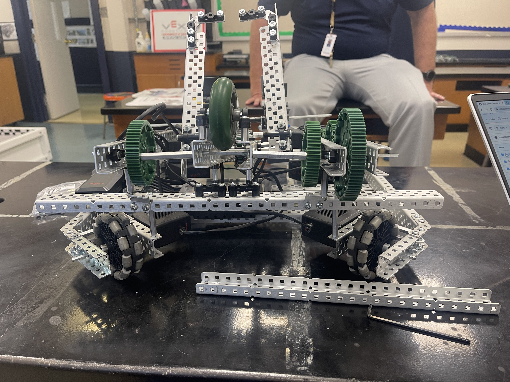
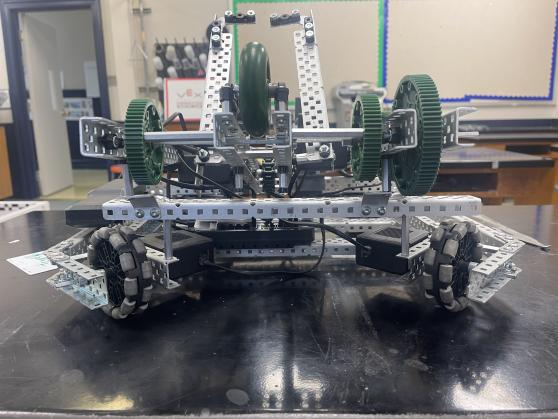

Today was nothing but **maintenance**. We switched the front support from a 35 to a 25. 

 
  --->  

We're now trying to figure out why our _scooper_ is so flimsy looking. We came to the conclusion that it was the fact we used different sized spacers because we were rushing to complete it. We took apart both arms and are trying to rebuild it properly this time. With only 3 weeks left till the competition, the safest course of action is to practice what we have and perfect our driving and our build quality.
