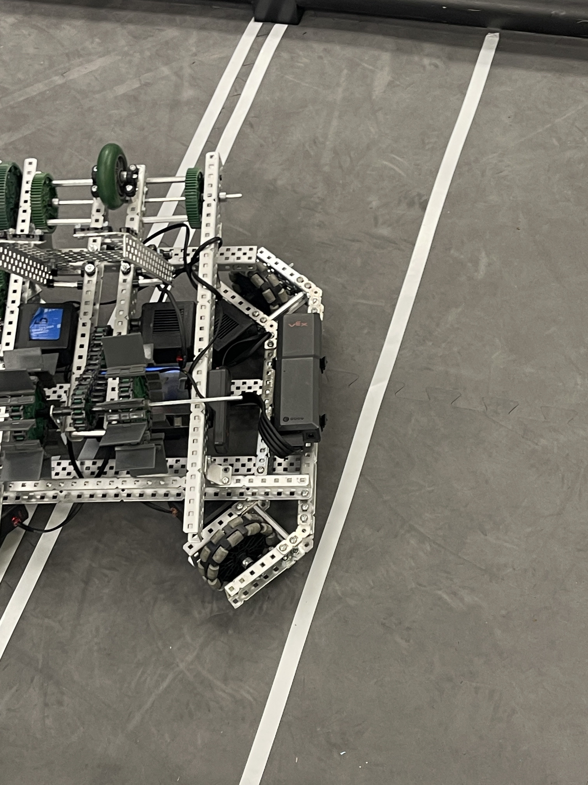

Today was **Another** day of fixing the build quality. We [straightened](https://cdn.discordapp.com/attachments/1160312586944925860/1164000792299192350/IMG_7086.jpg?ex=65419f36&is=652f2a36&hm=aeba8e240af689136130567c3f05cdd8dad17fbf743ebf285fd8b424c0ccd64e&) up the _scooper_ with a metal plate and tightened up the [gear](https://cdn.discordapp.com/attachments/1160312586944925860/1164000792299192350/IMG_7086.jpg?ex=65419f36&is=652f2a36&hm=aeba8e240af689136130567c3f05cdd8dad17fbf743ebf285fd8b424c0ccd64e&) that keeps getting losened after each practice session. We are currently trying to find a solution for that.
 

  

One problem we realized is that our battery is doomed to fall off with a simple hit from another robot. We spent a couple minutes trying to figure out an improvement to scoring the triballs without having to ram our robot into the goal.
