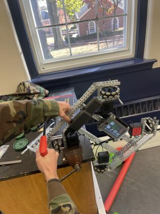

The competition is in two days. We have some doubts and concerns, but are feeling rather confident with our notebook as it was our main focus this year. 
---- -
Today our parts that we ordered came after weeks. We took the robot's upper half apart and started rewiring the whole robot. We had to specifically cut each wire for the desired length.  

### The Process:
First you had to find the size wire you needed for the robot. Then you had to cut it with the specific VEX tool. Then you had to strip the black off the wire to a certain point then you put the male connectors on and press on it with the tool to finalize the process. 

### Our Wire Lengths
* Port 1 = 30 cm
* Port 2 = 18 cm
* Port 3 = 30 cm
* Port 11 = 43 cm
* Port 10 = 30cm
* Port 21 = 6cm
#### One Notable thing :
We switched the ports for motor 4 to port 21 with a significantly shorter cable.

 

  

_The finished product of the base_

### The base
We made some slight adjustments to the base layout as well. For one we trimmed the X-Drive's shafts so it's not sticking too far out of the robot. 

