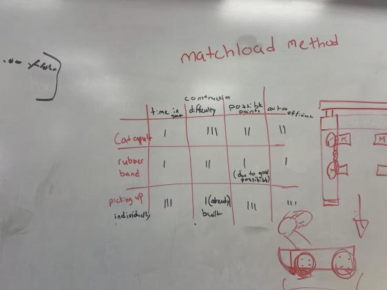

## First Competition of Over Under

We now realize that we are not competitive with our current robot. So now, before our second competition we need to make some changes. 

###  How the competition went
Our team placed last in the competition but received the Sportsmanship award. Our design was flawed and we decided to scrap the whole robot mid game and take apart the scooper and only use the X-Drive, We competed but lost with a record of 2-4. Usually we were the ones pushing the triballs that were catapulted over by our team. We went against 81x, a robot with a net to block catapulted match loads and that shut our scoring option down. 

### The changes in question

* Make a catapult **OR** a rubber band intake.
* We realized that we were the only team on Holonomic drive and began to think of switching

#### Pros of Switching
* more speed
* higher torque
* We were getting pushed around and wanted to prevent it
* We want to be able to compete both offensively and defensively

If we were to switch from X drive to tank drive, we would need to plan out motor usage and determine if we want a 6 motor drive or a 4 motor.

---
Our scoring mechanism was scrapped mid competition and for our next one we want to prevent that. 

(the least amount of tally marks is the best)

Here, we created a decision matrix for deciding which part would be best to build to build a rubber band intake. We are going to use a rubber band intake that doubles as a matchloader. We're either going to use our elevation arm or a piece of polycarbonate to drop the triball into the robot then with the rubber band intake, it'll shoot it out across the field towards to the other teams side, then we reverse and use the backend to push all the triballs into the opponents side and ram them into the goal.  
