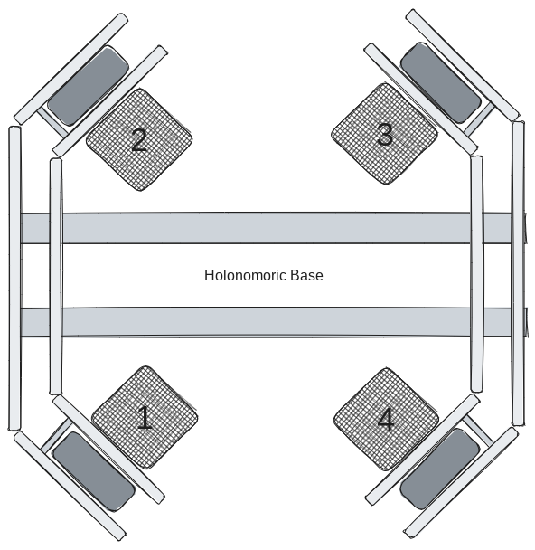
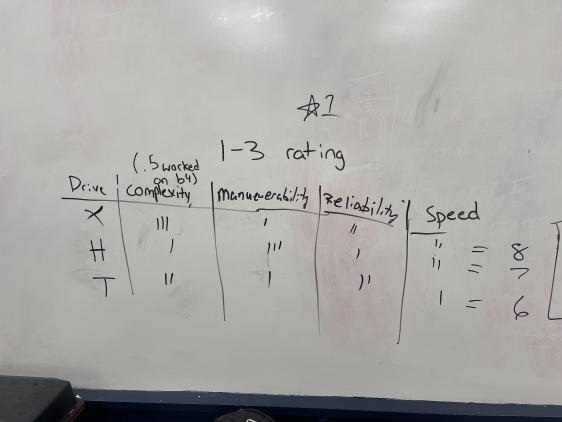

### Holonomic Drive
Our X-drive holonomic base is a 4 motor base design that needed custom cut c channels. We were able to compartmentalize each arm making it easy to conduct maintenace each motor.




## Decision Matrix


We made a Matrix for figuring out which base would be best for us. With the holonomic base being already built, we tallied up all the points with the holonomic base being graded for complexity on a (.5) scale because it was previously built and saved a lot of time.
### _Pros_ and _Cons_ of the X-Drive
* **Pros**
* Maneuverability
* strafing
* lower base height making it less of a worry to worry about the 18in tall restriction
* **Cons**
* it was a pain to code.
* due to the protruding wheels, we had to sacrifice build space for it.
* not the optimal drivetrain for this year's compettion
* The wheels have an inaccurate strafe
### Programming for the Drive
For this year we carried over the code for last year and merged some simple clawbot code into our holonomic code for it to command the top portion of our robot. 
```

#region VEXcode Generated Robot Configuration
from vex import *
import urandom

# Brain should be defined by default
brain=Brain()

# Robot configuration code
motor_1 = Motor(Ports.PORT1, GearSetting.RATIO_18_1, True)
motor_2 = Motor(Ports.PORT2, GearSetting.RATIO_18_1, True)
motor_3 = Motor(Ports.PORT3, GearSetting.RATIO_18_1, False)
motor_4 = Motor(Ports.PORT20, GearSetting.RATIO_18_1, False)
arm_motor5 = Motor(Ports.PORT10, GearSetting.RATIO_18_1,True)
motor_scoop6 = Motor(Ports.PORT11, GearSetting.RATIO_18_1,True)
controller_1 = Controller(PRIMARY)
arm_motor5.set_velocity(60,PERCENT)
motor_scoop6.set_velocity(25,PERCENT)

# wait for rotation sensor to fully initialize
wait(30, MSEC)
#endregion VEXcode Generated Robot Configuration
myVariable = 0

def when_started1():
    global myVariable
    motor_1.spin(FORWARD)
    motor_2.spin(FORWARD)
    motor_3.spin(FORWARD)
    motor_4.spin(FORWARD)
    while True:
        motor_1.set_velocity((controller_1.axis3.position() - (controller_1.axis4.position() + controller_1.axis1.position())), PERCENT)
        motor_2.set_velocity((controller_1.axis3.position() + (controller_1.axis4.position() - controller_1.axis1.position())), PERCENT)
        motor_3.set_velocity((controller_1.axis3.position() - (controller_1.axis4.position() - controller_1.axis1.position())), PERCENT)
        motor_4.set_velocity((controller_1.axis3.position() + (controller_1.axis4.position() + controller_1.axis1.position())), PERCENT)
        if controller_1.buttonL1.pressing():
            arm_motor5.spin(FORWARD)
        elif controller_1.buttonL2.pressing():
            arm_motor5.spin(REVERSE)
        else:
            arm_motor5.stop()

        if controller_1.buttonR1.pressing():
            motor_scoop6.spin(FORWARD)
        elif controller_1.buttonR2.pressing():
            motor_scoop6.spin(REVERSE)
        else:
            motor_scoop6.stop()
        wait(5, MSEC)


when_started1()
```

### challenges experienced with this drive
To perfect it over the course of two years, we went thru quite a few changes. Due to just having the parts for three clawbot kits and a c-channel kit, we had to work with what we had at first. We had to use 4 different variants of parts to connect the joints of the _X-Drive_. Our first one was from Home Depot that was used just to understand the concept of the build. We then used a Vex Pro part that we returned because it was too big on each corner and was rubbing against the wheel. We then swapped to the [gussets](https://www.vexrobotics.com/gussets.html) (version 1) before realizing we had to bend just to fit the the outside of base snug. We then switched them out for the other set of gussets that go on top of the joints of the robot and it was a perfect fit. After the first competition we had some minor flaws and decided to switch to the mini _holonomic_ wheels meaning we had to switch the channel joints to accommodate the smaller wheels. Towards the end of the last season once we finished competing, We took apart the base and  to [compartmentalize](https://cdn.discordapp.com/attachments/1160312586944925860/1162755950407589939/IMG_3280.JPG?ex=653d17dd&is=652aa2dd&hm=76ec7e29786e3e1cf29bf987a2ab720c69cc3f8b55b67ec441e7753d4f5789a0&) the robot so if we wanted to do maintenance we wouldn't have to take apart the whole thing but just one of it. The latest challenge was trying to fit the striker bot top half onto the bottom half of the _X-Drive_ bot.

## VEX Competition observations with this drive
### Over Under observations
1. We debated whether or not to go with the bigger _holonomic_ wheels to try and go across the pvc piping but decided not to due to time constraints.


2. Our performance is dependant on the driver. The _X-Drive_ is  very difficult to control. **BUT** in the right hands, it can save us time 

